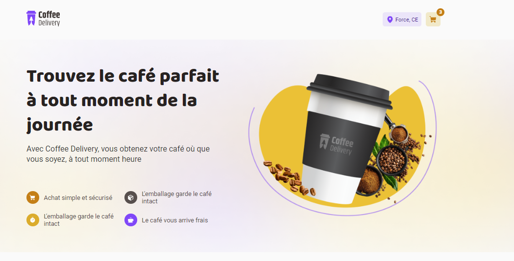
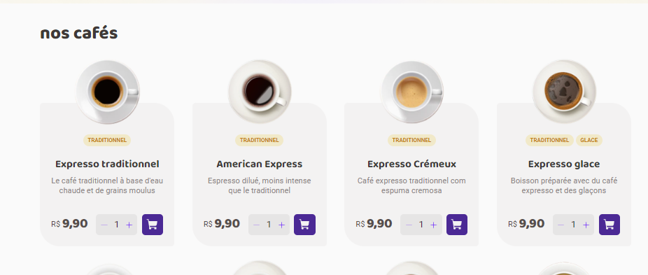
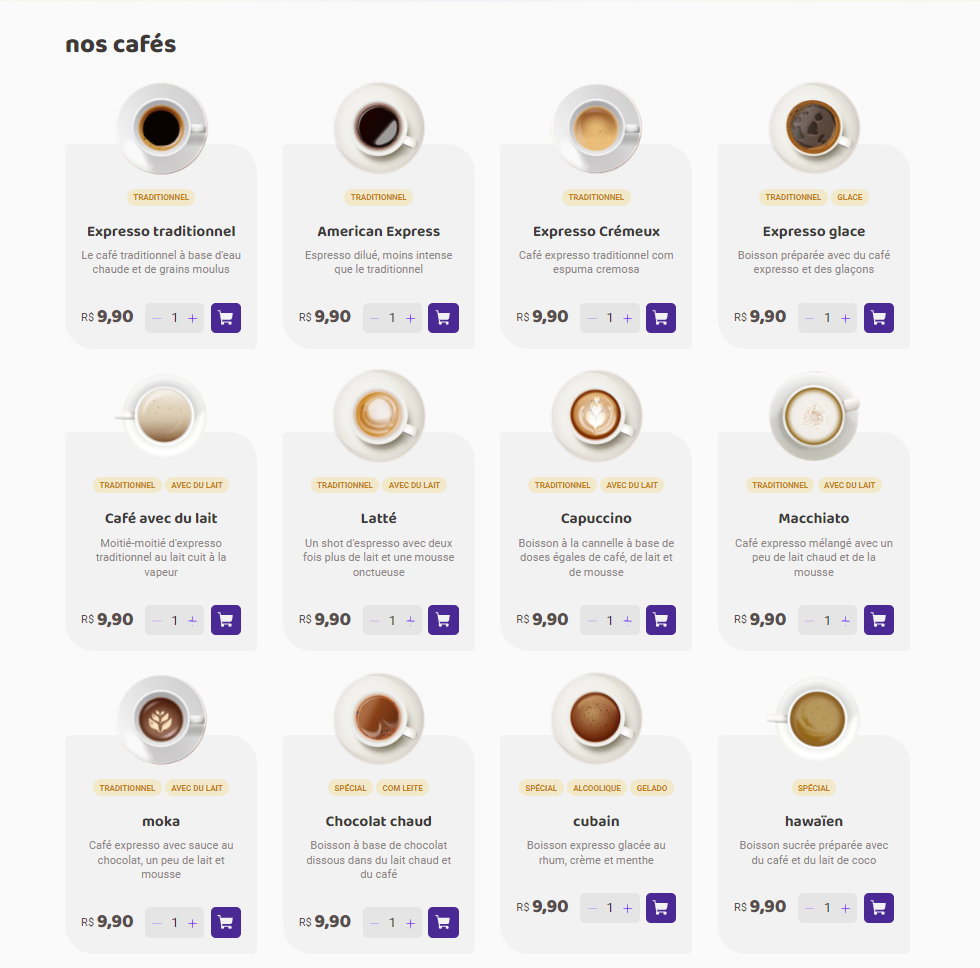
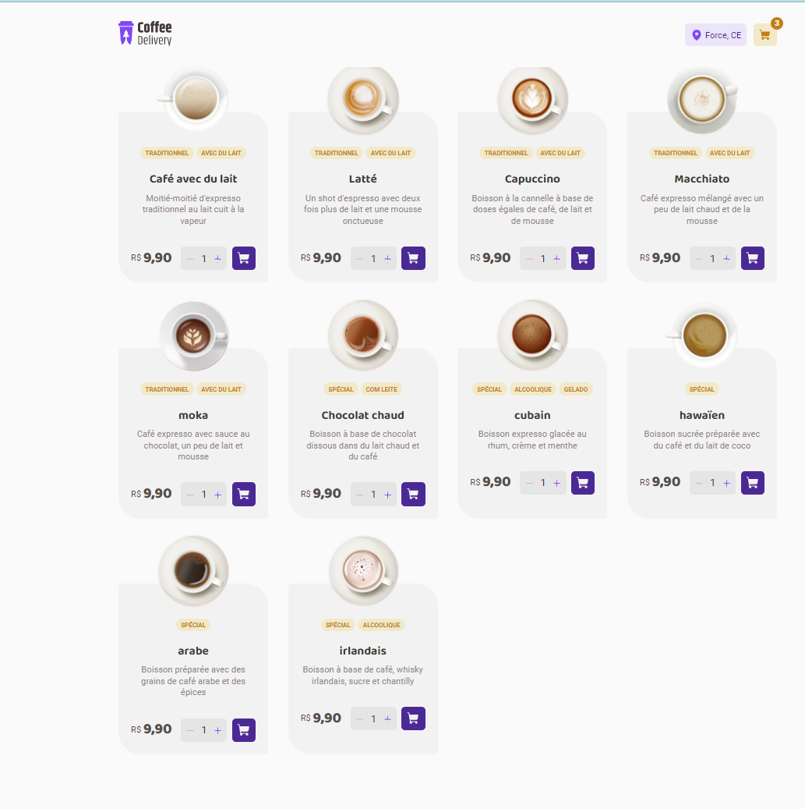
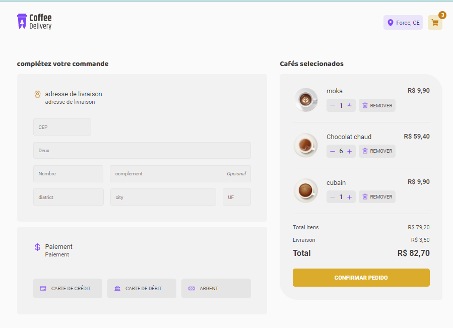
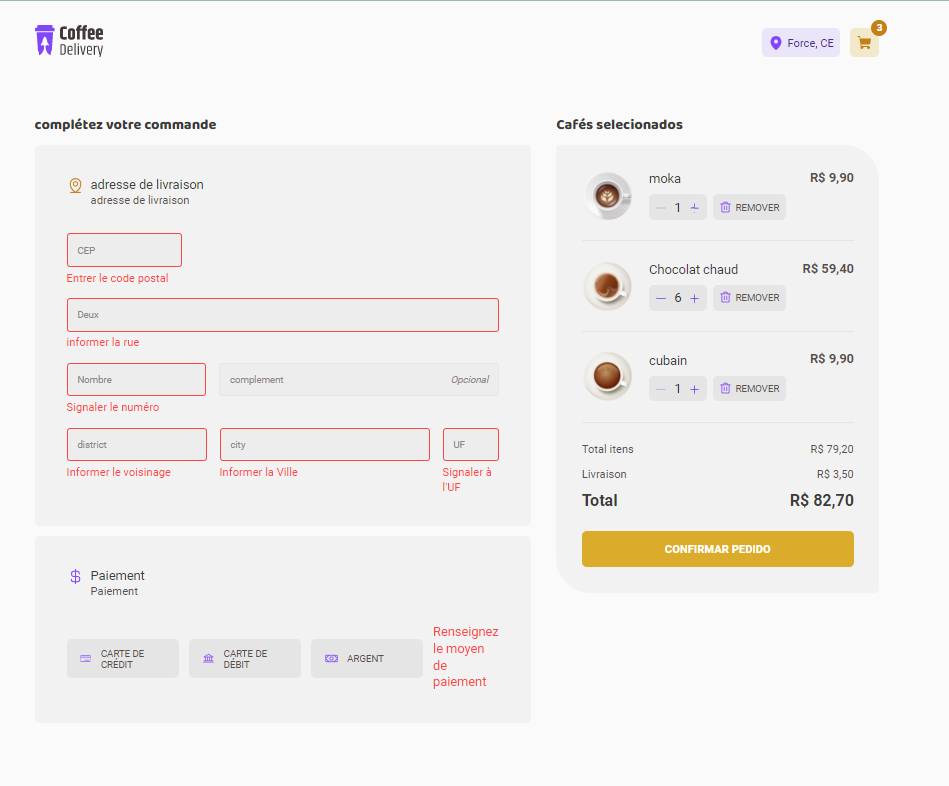

# A React E-commerce Website that you can buy differents types of Coffees

💻 Project

This is a project made entirely in React for an e-commerce coffee sales site to improve concepts such as Context API, Router, form validation through react-hook-form, and zod and styled components for styling.

🚀 Technologies

1. React
2. TypeScript
3. StyledComponents
4. Zod
5. ReactHookForm
6. ReactRouterDom

# `screenShot`

Made with ♥ by DIALLO MAMADOU SAMBA 👋🏻
